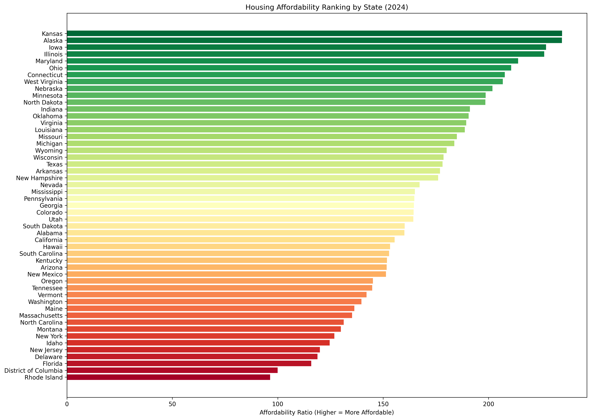
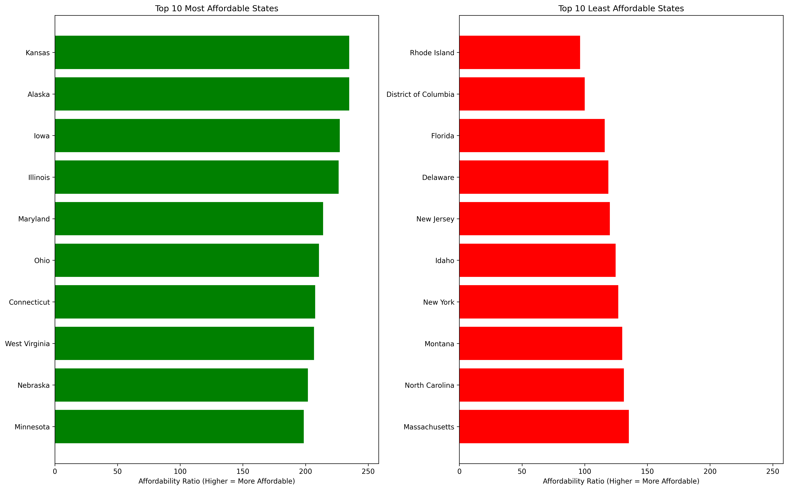
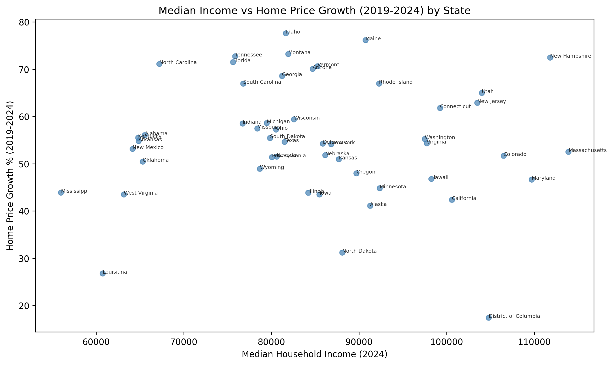

# Exploring Housing Affordability Across U.S. States

## Project Overview

This project looks at housing affordability across U.S. states by comparing median household income, recent home price growth, and an affordability ratio. I chose this topic because housing feels harder to reach for a lot of people in my generation, and I wanted to use data to get a clearer picture of where homeownership may be more realistic.

## Project Question

Which U.S. states appear to be the most affordable for first-time homebuyers when comparing median household income, home price growth, and overall housing affordability by state?

## Data Sources

This analysis uses state-level data from the U.S. Census Bureau and the FHFA House Price Index dataset.

## Tools Used

Python, pandas, NumPy, matplotlib, Jupyter Notebook, and scikit-learn

## Process

I started by loading both datasets into Python and narrowing them down to the state-level records needed for the analysis. From there, I cleaned and merged the data by state, used 2019 and 2024 FHFA values to calculate recent home price growth, and created an affordability ratio to compare states more directly.

After preparing the final dataset, I explored the results with visualizations and then applied linear regression and K-means clustering. This helped me look at affordability from more than one angle instead of relying on a single ranking alone.

## Key Visuals

## Results Summary

The results showed that housing affordability varies a lot by state and that looking at home prices alone does not tell the full story. Income and recent home price growth both changed how affordable a state appeared.

Some of the states that ranked among the most affordable in this analysis included Kansas, Alaska, and Iowa. Some of the least affordable included Rhode Island, the District of Columbia, and Florida.

The linear regression model had weak explanatory power, with an R-squared value of 0.138. That means median income and recent home price growth explained only a small part of the variation in affordability on their own.

The K-means clustering results were more useful for interpretation because they grouped states into high, mid, and low affordability patterns. That made the broader differences easier to compare than relying on a single list by itself.

## Limitations

This project is limited to state-level analysis, so it does not reflect differences within cities or counties. It also uses the FHFA House Price Index rather than direct home sale prices, which means it is better for identifying trends than showing exact home purchase costs.

## Takeaway

This project helped me practice cleaning and merging public datasets, building a custom affordability metric, creating visualizations, and interpreting model results honestly. One of the biggest takeaways for me was that affordability is shaped by more than one factor, and comparing states with data gives a clearer picture than relying on assumptions alone.